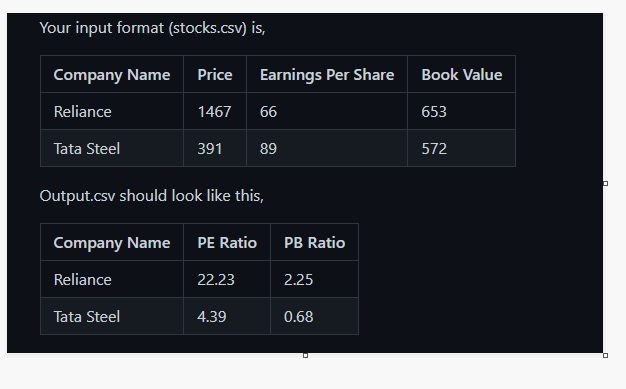

Exercise: Python Read Write File
poem.txt contains famous poem "Road not taken" by poet Robert Frost. You have to read this file in your python program and find out words with maximum occurance.
Solution

stocks.csv contains stock price, earnings per share and book value. You are writing a stock market application that will process this file and create a new file with financial metrics such as pe ratio and price to book ratio. These are calculated as,
pe ratio = price / earnings per share
price to book ratio = price / book value

